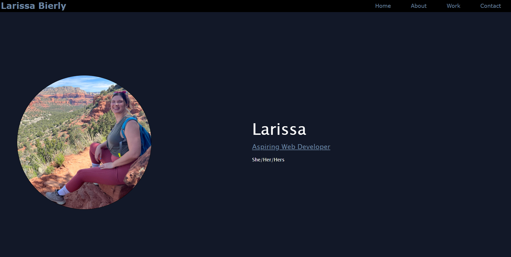

# Larissa-Portfolio-Website

## Description

A portfolio website for Larissa Bierly. In the header it includes my name at the top left and four links at the top right which lead you to other sections of the page. The body of the website includes a profile image at the top then three sections and a footer. The links at the top jump to their associated section. The work section has two functioning links attached to their corresponding pictures. This website is ADA accesible with alt attributes for images. Thank you!

### Skills Used

In this assignment I assigned links to images and to my github under contact me. I also used the transition property to add a glow like effect on all images. To the best of my ability I used width to ensure the first image under work was larger than the rest. I used absolute positioning to label all images.


## Installation

Install locally with:
```
git clone https://github.com/larsly/Larissa-Portfolio-Website
```

## Usage

To view the live website go to [https://larsly.github.io/Larissa-Portfolio-Website/](https://larsly.github.io/Larissa-Portfolio-Website/)

Click the links to go to specific sections of the web page as seen here.


## Credits

N/A

## License

Please refer to the LICENSE in the repo.
